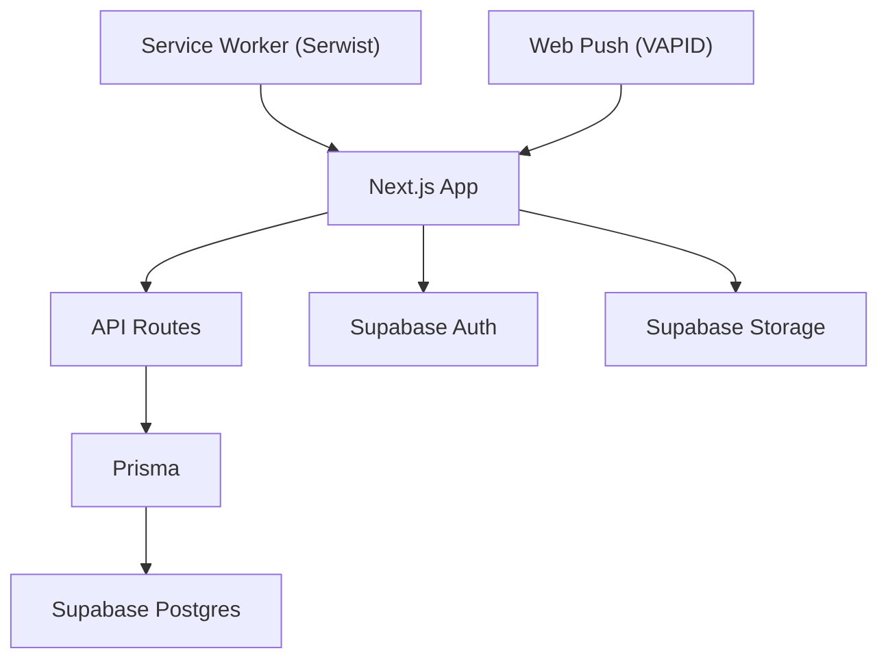
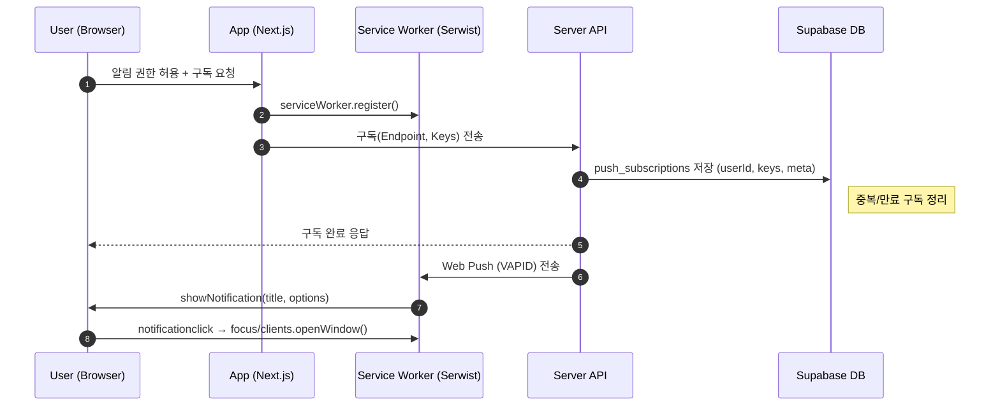
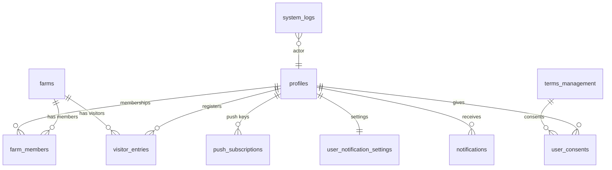

# 🌾 FarmPass — Demo App

<p align="center">
  <b>농장 방문자 출입을 QR로 디지털화하는 PWA 웹앱</b><br/>
  방역 준수 · 운영 자동화 · 실시간 대시보드 · 모바일 현장 최적화
</p>

<p align="center">
  <a href="https://farmpass.site"></a>
  
  
  
  
  
  
  
</p>

---

## TL;DR

**QR 코드 기반 방문자 출입·통계·알림까지 한 번에 관리하는 PWA.**

- 실시간 방문 현황/대시보드, 다중 농장·권한, 자동 정리(크론), 푸시 알림
- 모바일 현장 최적화(오프라인/설치), 보안(RLS)·감사 로그·성능 최적화

---

## Live Demo

- URL: https://farmpass.site
- Demo 계정(옵션): 로그인 페이지에서 체험할 계정 선택 -> 로그인 버튼 선택

> 자세한 사항은 사용자 메뉴얼 참조 [사용자 메뉴얼 - 농장 출입 관리 시스템](https://farmpass.site/docs/user-manual.html)

---

## 주요 기능 하이라이트

- **QR 출입**: 재방문 제한 시간, 일일방문 제한, 실시간 현황
- **방문자 관리**: 개별/대량(엑셀) 등록, 이력 검색/필터, CSV 내보내기
- **대시보드**: 일/주/월 추이, 시간대·목적별 통계, Chart.js 시각화
- **다중 농장 & 권한**: 소유자/관리자/구성원 역할, 농장별 완전 분리(RLS)
- **알림**: 웹푸시(VAPID), 이벤트·오류·운영 알림
- **운영 자동화**: 크론 기반 데이터 보존 정책(방문자/로그/구독/알림) 정리
- **PWA**: 오프라인 사용, 설치 배너, iOS/Android/데스크톱 지원(Serwist)
- **감사/보안**: 시스템 로그, JWT 인증, DB RLS, 관리자 우회 함수 분리

---

## Tech Stack

**Frontend**

- Next.js 14 (App Router), React 18, TypeScript 5
- Tailwind CSS, Radix UI, ShadCN/UI, Lucide
- TanStack React Query 5, React Hook Form + Zod
- Chart.js, qrcode.react, react-daum-postcode, react-day-picker / react-datepicker, react-markdown / @uiw/react-md-editor

**Backend / Infra**

- Next.js API Routes, Prisma 6.x
- Supabase: PostgreSQL · Auth · Storage · Realtime
- web-push(VAPID), Sentry, UptimeRobot(모니터링)

**PWA**

- Serwist(@serwist/next, @serwist/webpack-plugin) — 오프라인/캐싱 전략

---

### PWA & Service Worker (Serwist)

- 데스크탑 브라우저 및 Android, iOS(16.4+ 에서 푸시 알림 지원) 설치 가능
- 기본 페이지: 오프라인에서도 접근 가능
- 방문자 조회: 캐시된 데이터 표시
- 통계 대시보드: 마지막 동기화 데이터 표시
- 자동 동기화: 온라인 복구 시 데이터 자동 업데이트

> 자세한 사항은 [농장 출입 관리 시스템 - PWA 사용 가이드](https://www.farmpass.site/docs/pwa-guide.html) 참고

### 웹푸시 (VAPID)

- 새로운 방문자 등록시 푸시 알림 전송
- 시스템 공지사항이나 중요 알림 관리자를 통해 전체 전송 가능
- 관리가 계정으로 접속해서 시스템 설정 -> 알림탭 -> VAPID키 생성가능 system_settings 테이블에서 관리 또는 환경변수로 관리 가능

### Rate Limiting (슬라이딩 윈도우)

- 일반 API: IP당 90초에 100회
- 방문자 등록: IP당 24시간에 100회 (시스템 설정과 연동 의도 반영)
- 악성 봇 차단: IP당 1분에 5회
- 응답 헤더: `X-RateLimit-Limit`, `X-RateLimit-Remaining`, `X-RateLimit-Reset`, 초과 시 `Retry-After` 포함 (429 반환)

### Bot 방지 (Cloudflare Turnstile)

- 회원가입 시 Turnstile 위젯 로드 → 토큰 검증(`siteverify`)
- 실패 시 `400 TURNSTILE_FAIL` 코드로 일관 응답
- Rate Limit와 병행하여 악성 가입 차단

### 시스템 설정 (`system_settings`)

- 관리자만 접근 가능
- 로그인 보안, 비밀번호 정책, 방문자 정책, 로그, 유지보수 모드 등 설정가능
- 푸시에 필요한 VAPID키 생성 및 관리, 알림 메세지 템플릿 설정 및 푸시 알림 브로드캐스트 전송
- 불필요한 데이터 수동 정리 가능, 자동 정리는 Cron 스케줄 실행

### 스토리지 정책 (Supabase Storage Buckets)

- 프로필 이미지 등록 또는 시스템에 필요한 logo, favicon, icon, badge 이미지 저장소
- `profiles`(비공개): 경로 규칙 `userId/...` — 본인/관리자/같은 농장 구성원 접근, `systems` 폴더는 관리자만 업로드
- `visitor-photos`(공개): 현장 업로드/조회(운영 정책에 따라 제한 가능)

### 인증/권한 (Supabase Auth)

- OAuth 소셜 로그인: Google, Kakao, 소셜 계정 연동 계정관리 페이지에서 소셜 계정 연동, 해제 가능
- JWT Access Token + Refresh Token 자동 갱신
- Code Exchange(OAuth 콜백에서 `exchangeCodeForSession`) 지원
- 세션 지속: 탭/새로고침 간 유지, 만료 시 자동 재인증
- auth.users(내장) + public.profiles(앱 스키마) 이원화 가입 시 profiles 자동 생성(DB 트리거)
- 관리자 판별: Supabase `app_metadata.isAdmin`
- API 레벨에서 인증·권한 체크 후, 사용자 소속 농장 범위 내에서만 데이터 접근 허용

### 로깅 & 에러 표준화

- 보안 이벤트, 무단 접근 시도 감지, 권한 오류 등 자동 로깅
- 관리자는 시스템 관리페이지 -> 로그탭에서 조회 가능
- 개별 로그 → 통합 로깅으로 단순화(액션/레벨/컨텍스트/요청정보)
- 에러 정규화: Prisma/Supabase/Auth/Storage/DB 에러를 표준 코드로 매핑 → 일관된 메시지/응답 생성

---

## 🧱 아키텍처(요약)



---

## 데이터 모델 & 보안(요약)

- **핵심 테이블**: `profiles`, `farms`, `farm_members`, `visitor_entries`,
  `system_logs`, `system_settings`, `push_subscriptions`, `user_notification_settings`,
  `notifications`, `terms_management`, `user_consents`
- **RLS**: `is_system_admin()`(관리자 확인), `can_access_farm(row)`(농장 접근)으로 안전한 행 단위 접근 제어
- **Storage 정책**:
  - `profiles`(비공개): 본인/관리자/같은 농장 구성원 접근, 경로 규칙 `userId/...`
  - `visitor-photos`(공개): 현장 업로드/조회(운영 정책에 따라 제한 가능)
- **자동 정리(크론)**: 방문자·로그·푸시 구독·알림 보존 주기 기준 정리 함수 실행

> 상세 스키마/정책은 [[/docs/schema-rls.md]] 문서를 참고.

---

## 로컬 실행 (Getting Started)

```bash
# 1) 의존성 설치
npm i

# 2) 환경변수 작성
cp .env.example .env.local

# 3) Prisma 클라이언트 생성/마이그레이션
npm run migrate:dev

# 4) 초기 db seed 생성(시스템설정, 약관초기 데이터 생성)
npx prisma db seed

# 5) 개발 서버 시작
npm run dev
```

### `.env.example` (업데이트)

````env
# === Supabase ===
NEXT_PUBLIC_SUPABASE_URL=<your_supabase_project_url>
NEXT_PUBLIC_SUPABASE_ANON_KEY=<your_supabase_anon_key>   # public (클라이언트에서 사용)
SUPABASE_SERVICE_ROLE_KEY=<your_service_role_key>        # secret (서버전용)

# === Database (Prisma) ===
DATABASE_URL=postgresql://<user>:<pass>@<host>:<port>/<db>?pgbouncer=true
DIRECT_URL=postgresql://<user>:<pass>@<host>:5432/<db>

# === App / Site ===
NEXT_PUBLIC_APP_VERSION=0.1.0
NEXT_PUBLIC_SITE_URL=http://localhost:3000

# === Web Push (VAPID) ===
NEXT_PUBLIC_VAPID_PUBLIC_KEY=<your_vapid_public_key>     # public
VAPID_PRIVATE_KEY=<your_vapid_private_key>               # secret

# === Cloudflare Turnstile ===
NEXT_PUBLIC_TURNSTILE_SITE_KEY=<your_turnstile_site_key> # public
TURNSTILE_SECRET_KEY=<your_turnstile_secret_key>         # secret

# === Rate Limiting (기본값 예시) ===
RATE_LIMIT_MAX=100
RATE_LIMIT_WINDOW_MS=90000
VISITOR_RATE_LIMIT_MAX=100
VISITOR_RATE_LIMIT_WINDOW_MS=86400000

# === Health / Ops ===
MEMORY_THRESHOLD=500     # MB
CPU_THRESHOLD=80         # percent
DB_TIMEOUT=5000          # ms
UPTIMEROBOT_API_KEY=<your_uptimerobot_api_key>

# === Analytics ===
NEXT_PUBLIC_GOOGLE_ANALYTICS=G-XXXXXXXXXX                # public GA4 ID
GA4_PROPERTY_ID=<ga4_property_id>
GA_SERVICE_ACCOUNT_KEY="{ JSON service account key here }"  # secret(JSON 문자열 전체)

# === Sentry ===
NEXT_PUBLIC_SENTRY_DSN=<your_public_dsn>                 # public
SENTRY_AUTH_TOKEN=<your_sentry_auth_token>               # secret
```env
````

### Supabase Database Function

- Auth 관련 함수 추가 [[scripts/auth-function.sql]] 참고
- 방문자 데이터 정리, 시스템 로그 자동 정리, 만료 푸시 구독 자동 정리, 인앱 알림 자동 정리 함수 추가 및 Cron 스케줄 등록 필요 [[scripts/자동삭제함수.sql]] 참고

### Supabase Auth & RLS 정책

- 카카오, 구글 로그인 Auth Provider 등록 필요 api key, client id, client secret값 필요
- 이메일 전송(이메일 확인, 비밀번호 재설정)에 필요한 SMTP Provider Setting 필요 (Resend 적용)
- URL Configuration -> Site URL 등록
- Database RLS 활성화 및 정책 추가 필요 [[scripts/project-policy.sql]] 참고
- Storage 관련 RLS 정책 추가 필요 [[scripts/image-upload-policy.sql]] 참고

---

## 🔐 환경변수 레퍼런스(요약 표)

| Key                              | Scope  | Required | Default/예시            | 설명                                                  |
| -------------------------------- | ------ | -------: | ----------------------- | ----------------------------------------------------- |
| `NEXT_PUBLIC_SUPABASE_URL`       | Public |       ✅ | –                       | Supabase 프로젝트 URL (클라이언트에서 사용)           |
| `NEXT_PUBLIC_SUPABASE_ANON_KEY`  | Public |       ✅ | –                       | Supabase anon key (read 권한)                         |
| `SUPABASE_SERVICE_ROLE_KEY`      | Server |       ✅ | –                       | Supabase service role key (서버 전용, 절대 노출 금지) |
| `DATABASE_URL`                   | Server |       ✅ | –                       | Prisma/DB 연결(PgBouncer 권장)                        |
| `DIRECT_URL`                     | Server |       ✅ | –                       | Prisma direct 연결(마이그레이션 등)                   |
| `NEXT_PUBLIC_SITE_URL`           | Public |       ✅ | `http://localhost:3000` | 비밀번호 재설정 등 링크 생성                          |
| `NEXT_PUBLIC_VAPID_PUBLIC_KEY`   | Public |       ✅ | –                       | 웹푸시 공개키                                         |
| `VAPID_PRIVATE_KEY`              | Server |       ✅ | –                       | 웹푸시 비밀키(서버 전용)                              |
| `NEXT_PUBLIC_TURNSTILE_SITE_KEY` | Public |       ⭕ | –                       | Cloudflare Turnstile 사이트키                         |
| `TURNSTILE_SECRET_KEY`           | Server |       ⭕ | –                       | Turnstile 시크릿키                                    |
| `RATE_LIMIT_MAX`                 | Server |       ⭕ | `100`                   | 일반 API 윈도우 내 허용량                             |
| `RATE_LIMIT_WINDOW_MS`           | Server |       ⭕ | `90000`                 | 일반 API 윈도우(ms)                                   |
| `VISITOR_RATE_LIMIT_MAX`         | Server |       ⭕ | `100`                   | 방문자 등록 허용량                                    |
| `VISITOR_RATE_LIMIT_WINDOW_MS`   | Server |       ⭕ | `86400000`              | 방문자 등록 윈도우(ms)                                |
| `MEMORY_THRESHOLD`               | Server |       ⭕ | `500`                   | 메모리 임계치(MB)                                     |
| `CPU_THRESHOLD`                  | Server |       ⭕ | `80`                    | CPU 임계치(%)                                         |
| `DB_TIMEOUT`                     | Server |       ⭕ | `5000`                  | DB 타임아웃(ms)                                       |
| `UPTIMEROBOT_API_KEY`            | Server |       ⭕ | –                       | 가용성 모니터링 API 키                                |
| `NEXT_PUBLIC_GOOGLE_ANALYTICS`   | Public |       ⭕ | –                       | GA4 측정ID(G-XXXX...)                                 |
| `GA4_PROPERTY_ID`                | Server |       ⭕ | –                       | GA4 속성 ID                                           |
| `GA_SERVICE_ACCOUNT_KEY`         | Server |       ⭕ | –                       | GA 서비스 계정 JSON(문자열 전체)                      |
| `NEXT_PUBLIC_SENTRY_DSN`         | Public |       ⭕ | –                       | Sentry DSN                                            |
| `SENTRY_AUTH_TOKEN`              | Server |       ⭕ | –                       | Sentry 토큰(릴리스/소스맵 업로드)                     |

---

## 🔔 푸시 알림 플로우 (Mermaid)



---

## 🗺️ ER 다이어그램



---

## 🧠 캐싱 전략 (Serwist)

**Precache(정적 자원)** — 빌드 시점에 고정 리소스를 선캐싱합니다.

- 페이지: `/`, `/offline`, `/maintenance`
- 메타: `/manifest.json`, `/favicon.ico`, `/favicon.png`
- 로고: `/logo.svg`, `/logo.png`, `/logo1.svg`, `/logo1.png`
- 아이콘: `/icon-72x72.png`, `/icon-57x57.png`, `/icon-96x96.png`, `/icon-120x120.png`, `/icon-144x144.png`, `/icon-152x152.png`, `/icon-167x167.png`, `/icon-180x180.png`, `/icon-192x192.png`, `/icon-384x384.png`, `/icon-512x512.png`, `/icon-1024x1024.png`
- 소셜 버튼: `/btn_kakao.svg`, `/btn_google.svg`, `/btn_kakao_ch.svg`, `/btn_blog.svg`, `/btn_homepage.svg`, `/btn_mail.svg`
- Lottie: `/lottie/success.json`, `/lottie/error.json`, `/lottie/warning.json`, `/lottie/info.json`, `/lottie/timeout.json`, `/lottie/no_connection.json`, `/lottie/404.json`, `/lottie/cat_loading.json`
- 문서: `/docs/user-manual.html`, `/docs/pwa-guide.html`, `/docs/product-overview.html`, `/docs/quick-start.html`, `/docs/faq.html`
- 최대 캐시 파일 크기: **10MB**

**Runtime Caching**

- **HTML 내비게이션**: Network First → 실패 시 `/offline` 폴백
- **API(`/api/*`)**: Network First(짧은 타임아웃)
- **Supabase Storage 이미지**: Stale-While-Revalidate
- **폰트/CDN 정적**: Cache First(긴 max-age)

**Bypass/Ignore**

- Next 내부 경로: `/_next/static/*`, `/_next/image*` (Next가 자체 처리)
- 변이 요청: `POST/PUT/PATCH/DELETE`
- 민감 경로: 관리자/설정 등

---

## 📚 Reference

- 데이터베이스 스키마 & RLS: `docs/schema-and-rls.md`
- 사용자 메뉴얼: [사용자 매뉴얼 - 농장 출입 관리 시스템](https://www.farmpass.site/docs/user-manual.html)
- 시작 가이드: [농장 출입 관리 시스템 - 빠른 시작 가이드](https://www.farmpass.site/docs/quick-start.html)
- PWA 가이드: [농장 출입 관리 시스템 - PWA 사용 가이드](https://www.farmpass.site/docs/pwa-guide.html)

## 👋 문의

- 📧 sosiluv@gmail.com
