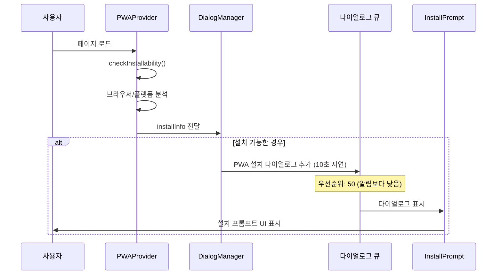

# 🔍 PWA 설치 프롬프트 시스템 - 기술 분석 문서

## 📋 개요

농장 출입 관리 시스템의 PWA 설치 프롬프트는 사용자 경험을 최적화하면서 다양한 플랫폼과 브라우저에서 일관된 설치 경험을 제공하기 위해 설계되었습니다. 이 문서는 PWA 설치 프롬프트의 전체적인 아키텍처, 이벤트 플로우, 에지 케이스 처리를 상세히 분석합니다.

---

## 🏗️ 시스템 아키텍처

### 1. 핵심 컴포넌트

#### PWAProvider (`components/providers/pwa-provider.tsx`)

- **역할**: 브라우저 호환성 검사 및 설치 가능 여부 판단
- **기능**:
  - 플랫폼별 설치 가능 여부 검사 (iOS, Android, Desktop)
  - 브라우저별 지원 방식 분류 (banner, manual, none)
  - PWA 모드 실행 여부 감지 (`standalone` mode)
  - Context API를 통한 전역 상태 관리

```typescript
interface InstallInfo {
  canInstall: boolean;
  platform: "iOS" | "Android" | "Desktop" | "Unknown";
  method: "banner" | "manual" | "none";
  reason?: string;
  isStandalone: boolean;
  userAgent: string;
}
```

#### DialogManager (`components/common/DialogManager.tsx`)

- **역할**: 시스템 다이얼로그 우선순위 관리 및 표시 제어
- **기능**:
  - 다이얼로그 큐 관리 (알림 권한 vs PWA 설치)
  - 우선순위 기반 표시 순서 제어
  - 10초 지연 후 PWA 설치 프롬프트 표시

#### InstallPrompt (`components/common/InstallPrompt.tsx`)

- **역할**: 실제 설치 프롬프트 UI 구현
- **기능**:
  - 플랫폼별 맞춤형 메시지 및 아이콘
  - 24시간 거부 기간 관리 (localStorage)
  - 알림 권한 다이얼로그와의 충돌 방지
  - 애니메이션 효과 (framer-motion)

#### 다이얼로그 큐 시스템 (`store/use-dialog-queue.ts`)

- **역할**: 시스템 다이얼로그의 우선순위 및 순서 관리
- **기능**:
  - 우선순위 기반 큐 관리
  - 시스템 vs 사용자 다이얼로그 분류
  - 동시 표시 방지 및 순차 처리

---

## 🔄 이벤트 플로우

### 1. 초기화 과정



### 2. 설치 가능 여부 판단 로직

```typescript
const checkInstallability = (): InstallInfo => {
  // 1. 이미 PWA 모드로 실행 중인지 확인
  if (isStandalone)
    return { canInstall: false, reason: "이미 PWA 모드로 실행 중" };

  // 2. 플랫폼별 설치 지원 확인
  if (isIOS && isSafari) return { canInstall: true, method: "manual" };
  if (isAndroid && isChrome) return { canInstall: true, method: "banner" };
  if (isDesktop && (isChrome || isEdge))
    return { canInstall: true, method: "banner" };

  // 3. 지원되지 않는 환경
  return { canInstall: false, reason: "지원되지 않는 브라우저" };
};
```

### 3. 다이얼로그 표시 우선순위

1. **사용자 다이얼로그**: 최고 우선순위 (즉시 표시)
2. **알림 권한 다이얼로그**: 우선순위 100 (현재 비활성화)
3. **PWA 설치 다이얼로그**: 우선순위 50
4. **기타 시스템 다이얼로그**: 우선순위에 따라 순차 처리

---

## 🎯 플랫폼별 설치 전략

### 1. Android Chrome/Edge

- **방식**: `beforeinstallprompt` 이벤트 + 자동 배너
- **특징**: 브라우저 자체 설치 배너 지원
- **사용자 경험**:
  - 하단 배너 자동 표시
  - "홈 화면에 추가" 버튼
  - 네이티브 설치 프롬프트

### 2. iOS Safari

- **방식**: 수동 설치 안내
- **특징**: 공유 버튼을 통한 설치
- **사용자 경험**:
  - Safari 공유 메뉴 안내
  - "홈 화면에 추가" 옵션
  - iOS 16.4+ 푸시 알림 지원

### 3. Desktop Chrome/Edge

- **방식**: 주소창 설치 아이콘 + 프롬프트
- **특징**: 브라우저 UI 통합 설치
- **사용자 경험**:
  - 주소창 설치 아이콘 (⊕)
  - 자동 바탕화면 바로가기 생성

### 4. 기타 브라우저

- **방식**: 설치 불가능 또는 제한적 지원
- **처리**: 설치 프롬프트 비표시

---

## ⚠️ 에지 케이스 및 예외 처리

### 1. 충돌 방지 메커니즘

#### 알림 권한 다이얼로그와의 충돌

```typescript
// InstallPrompt.tsx에서 알림 다이얼로그 감지
const notificationDialog = document.querySelector(
  '[data-notification-dialog="true"]'
);
const isNotificationOpen =
  notificationDialog &&
  window.getComputedStyle(notificationDialog).display !== "none";

if (isNotificationOpen) {
  // 10초 후 다시 시도
  setTimeout(() => setShowPrompt(true), 10000);
}
```

#### 중복 표시 방지

- **localStorage 기반 설치 완료 상태 추적**
  - `pwa_install_completed`: 설치 버튼 클릭 시 저장
  - `pwa_install_dismissed`: 거부 시 24시간 저장
- **다이얼로그 큐 시스템을 통한 순차 처리**
- **이미 PWA 모드 실행 시 프롬프트 비표시**
- **beforeinstallprompt/appinstalled 이벤트 활용**

#### 설치 상태 감지 로직

```typescript
// PWAProvider.tsx에서 다중 체크
1. window.matchMedia("(display-mode: standalone)") // PWA 모드 실행
2. localStorage.getItem("pwa_install_completed")    // 설치 완료 기록
3. beforeinstallprompt 이벤트 부재                   // 브라우저 자체 판단
4. appinstalled 이벤트 감지                        // 실제 설치 완료
```

### 2. 브라우저 호환성 이슈

#### Safari 지원

- iOS Safari만 PWA 설치 지원
- Chrome/Firefox는 설치 불가능
- iOS 16.4 미만 푸시 알림 미지원

#### Samsung Internet 지원

- Android Samsung Internet 별도 처리
- 메뉴 기반 수동 설치 안내

#### Firefox 제한

- Desktop Firefox PWA 설치 제한적 지원
- "앱으로 설치" 기능 안내

### 3. 네트워크 및 성능 이슈

#### 오프라인 상태 처리

- 설치 가능 여부 체크는 클라이언트사이드에서 수행
- 네트워크 의존성 최소화

#### 메모리 최적화

- Context 값 메모이제이션 (`useMemo`)
- 불필요한 리렌더링 방지

---

## 🔧 설정 및 커스터마이징

### 1. 표시 시점 조정

```typescript
// DialogManager.tsx
const timer = setTimeout(() => {
  addDialog({
    type: "pwa-install",
    priority: 50,
    data: { installInfo },
    isSystemDialog: true,
  });
}, 10000); // 10초 지연 (조정 가능)
```

### 2. 거부 기간 설정

```typescript
// InstallPrompt.tsx
const oneDayAgo = Date.now() - 24 * 60 * 60 * 1000; // 24시간 (조정 가능)
if (dismissedTime < oneDayAgo) {
  localStorage.removeItem("pwa_install_dismissed");
}
```

### 3. 플랫폼별 메시지 커스터마이징

```typescript
const getInstallText = () => {
  switch (installInfo.platform) {
    case "iOS":
      return "홈 화면에 추가";
    case "Android":
      return "앱으로 설치";
    case "Desktop":
      return "앱으로 설치";
    default:
      return "설치하기";
  }
};
```

---

## 📊 사용자 경험 최적화

### 1. 점진적 노출 전략

- **1단계**: 페이지 로드 후 10초 대기
- **2단계**: 알림 권한 다이얼로그 우선 처리
- **3단계**: PWA 설치 프롬프트 표시
- **4단계**: 거부 시 24시간 대기

### 2. 시각적 개선사항

- **애니메이션**: framer-motion을 통한 부드러운 등장/퇴장
- **반응형 디자인**: 모바일/데스크톱 최적화
- **플랫폼별 아이콘**: 직관적인 설치 안내

### 3. 접근성 고려사항

- **키보드 네비게이션**: Tab 키 지원
- **스크린 리더**: ARIA 레이블 적용
- **고대비 모드**: 색상 대비 최적화

---

## 🐛 알려진 이슈 및 해결방안

### 1. iOS Safari 제한사항

- **이슈**: Chrome/Firefox에서 PWA 설치 불가능
- **해결**: Safari 사용 안내 메시지 표시

### 2. Android 브라우저 파편화

- **이슈**: 브라우저별 설치 방식 상이
- **해결**: User-Agent 기반 세밀한 감지

### 3. Desktop PWA 인식 부족

- **이슈**: 사용자의 PWA 개념 이해 부족
- **해결**: 명확한 설명과 혜택 안내

---

## 🔮 향후 개선 계획

### 1. beforeinstallprompt 이벤트 활용

```typescript
// 향후 구현 예정
window.addEventListener("beforeinstallprompt", (e) => {
  e.preventDefault();
  setDeferredPrompt(e);
  // 커스텀 타이밍에 프롬프트 표시
});
```

### 2. 설치 후 사용자 행동 분석

- 설치율 추적
- 사용 패턴 분석
- A/B 테스트 도입

### 3. 개인화된 설치 안내

- 사용자 행동 기반 최적 타이밍 결정
- 디바이스별 맞춤형 메시지

---

## 📈 성과 지표

### 1. 설치 전환율

- **측정 지표**: 프롬프트 표시 대비 실제 설치율
- **목표**: 15% 이상 전환율 달성

### 2. 사용자 만족도

- **측정 지표**: 거부율 및 재방문율
- **목표**: 거부율 30% 이하 유지

### 3. 플랫폼별 성과

- **iOS**: 수동 설치 안내 효율성
- **Android**: 자동 배너 전환율
- **Desktop**: 주소창 아이콘 클릭률

---

## 🛠️ 개발자 가이드

### 1. 새로운 플랫폼 지원 추가

```typescript
// PWAProvider.tsx의 checkInstallability 함수 수정
if (isNewPlatform) {
  return {
    canInstall: true,
    platform: "NewPlatform",
    method: "custom",
    reason: "새 플랫폼 지원",
    isStandalone: false,
    userAgent,
  };
}
```

### 2. 커스텀 설치 프롬프트 개발

```typescript
// 새로운 다이얼로그 타입 추가
export type SystemDialogType =
  | "notification"
  | "pwa-install"
  | "custom-install"; // 새 타입 추가
```

### 3. 디버깅 및 테스트

```typescript
// 개발 환경에서 강제 프롬프트 표시
if (process.env.NODE_ENV === "development") {
  // 테스트용 강제 표시 로직
}
```

---

## 📚 참고 자료

### 1. Web API 문서

- [MDN: beforeinstallprompt](https://developer.mozilla.org/en-US/docs/Web/API/BeforeInstallPromptEvent)
- [MDN: Web App Manifest](https://developer.mozilla.org/en-US/docs/Web/Manifest)

### 2. 플랫폼별 가이드

- [Android PWA 설치 가이드](https://developers.google.com/web/fundamentals/app-install-banners)
- [iOS PWA 설치 가이드](https://developer.apple.com/documentation/webkit/configuring_your_website_to_be_a_web_app)

### 3. 모범 사례

- [PWA 설치 UX 패턴](https://web.dev/promote-install/)
- [설치 프롬프트 최적화](https://web.dev/install-criteria/)

---

## 📝 결론

현재 구현된 PWA 설치 프롬프트 시스템은 다양한 플랫폼과 브라우저에서 일관되고 최적화된 사용자 경험을 제공합니다. 특히 다이얼로그 충돌 방지, 플랫폼별 맞춤형 안내, 점진적 노출 전략을 통해 사용자의 거부감을 최소화하면서 설치 전환율을 극대화하도록 설계되었습니다.

향후 `beforeinstallprompt` 이벤트 활용, 사용자 행동 분석, 개인화된 설치 안내 등의 개선사항을 통해 더욱 효과적인 PWA 설치 경험을 제공할 수 있을 것으로 기대됩니다.

---

## 🆕 PWA 삭제 감지 및 재설치 지원 (2024-01-XX 추가)

### PWA 삭제 감지 메커니즘

```typescript
const checkPWAUninstall = () => {
  const installCompleted = localStorage.getItem("pwa_install_completed");
  const isStandalone = window.matchMedia("(display-mode: standalone)").matches;

  // 설치 완료 기록이 있지만 standalone 모드가 아닌 경우
  if (installCompleted && !isStandalone) {
    // beforeinstallprompt 이벤트 재확인으로 삭제 여부 판단
    let canReinstall = false;

    const testPrompt = (e: Event) => {
      canReinstall = true;
      e.preventDefault();
    };

    window.addEventListener("beforeinstallprompt", testPrompt);

    setTimeout(() => {
      window.removeEventListener("beforeinstallprompt", testPrompt);

      if (canReinstall) {
        // PWA 삭제 확인됨 - localStorage 정리
        localStorage.removeItem("pwa_install_completed");
        localStorage.removeItem("pwa_install_dismissed");
        // 설치 가능 상태로 복구
      }
    }, 1000);
  }
};
```

### 삭제 감지 트리거

1. **페이지 로드 시**: 초기 삭제 상태 체크
2. **visibilitychange 이벤트**: 사용자가 다른 탭에서 돌아올 때 재체크
3. **beforeinstallprompt 이벤트**: 브라우저가 다시 설치 가능하다고 판단할 때

### 사용자 시나리오

#### 시나리오 1: 정상 설치 → 삭제 → 재설치

1. 사용자가 PWA 설치 ✅
2. `pwa_install_completed` localStorage 저장 ✅
3. 사용자가 홈화면에서 PWA 앱 삭제 🗑️
4. 다음 방문 시 삭제 감지 및 localStorage 정리 🔄
5. 설치 프롬프트 다시 표시 가능 ✅

#### 시나리오 2: 알림 권한 거부 → 7일 후 재요청

1. 알림 권한 거부 ❌
2. `notification_permission_${userId}` localStorage에 타임스탬프 저장 ⏰
3. 7일 후 로그인 시 자동 재요청 🔄
4. 우선순위에 따라 알림 권한 → PWA 설치 순서로 표시 📋

---
